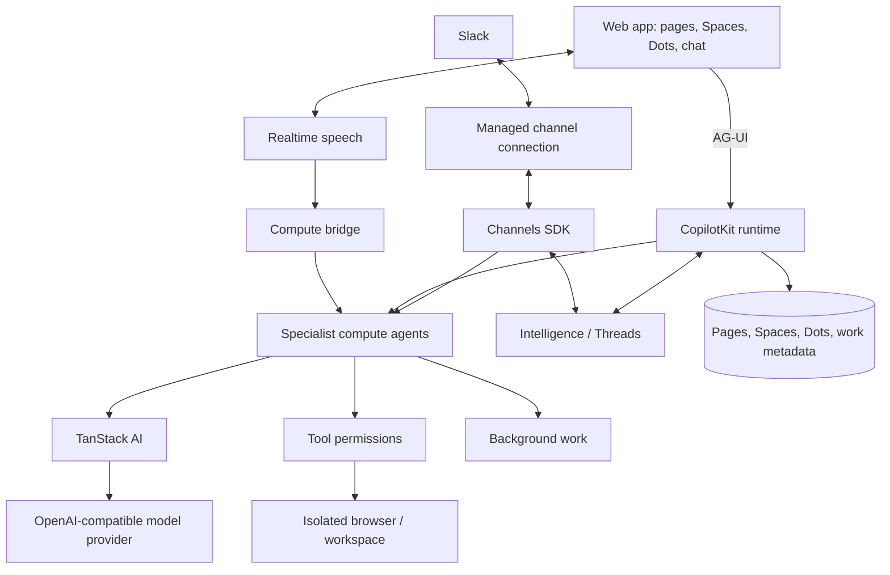

<div align="center">

# OpenDots

### OpenDots on FeltDB — a development control plane with durable application state.

**An open-source control plane for AI coworkers, with durable state powered by FeltDB. Available on Web and Mobile.**

Built with [CopilotKit](https://github.com/CopilotKit/CopilotKit), [AG-UI](https://docs.ag-ui.com/introduction) and [FeltDB](https://www.npmjs.com/package/@feltdb/core). · [Get started](#get-started) · [Overview](#overview) · [Architecture](#architecture) · [Status](#development-status) · [Contributing](CONTRIBUTING.md)

[](https://github.com/CopilotKit/OpenDots/actions/workflows/ci.yml)
[](./LICENSE)


Fully self-hostable.

[**Building on OpenDots? Meet with the CopilotKit team →**](https://www.copilotkit.ai/talk-to-an-engineer?ref=opendots_readme)

</div>

---

## What OpenDots is

OpenDots is a **development control plane** with durable application state. It is
where you define Dots (your AI coworkers), the Spaces they work in, the Tasks
they run, and the Pages they produce — and it remembers all of it across restarts.

```
OpenDots
   │
   ├── feltdb.flow          authoritative FeltDB application contract
   ├── domain stores        application behaviour (tasks, dots, work)
   └── FeltDB               sole runtime durable-state authority
```

### What FeltDB provides

FeltDB is the durable state authority. It stores every Space, Dot, Task, Run,
Memory, Page, review, conversation binding, capture and computer-permission
record, and it is what makes state survive a restart.

### The `.flow` contract

[`feltdb.flow`](./feltdb.flow) is the authoritative application contract. It
declares the OpenDots identity and all 18 durable collections with their fields
and relationships, and OpenDots refuses to start if its runtime uses a collection
the contract does not declare.

Validate it with the pinned FeltDB CLI:

```sh
node node_modules/@feltdb/core/bin/feltdb.js validate feltdb.flow
# ✓ OpenDots: 18 collections
```

See [docs/CONTRACT-FELTDB-FLOW.md](docs/CONTRACT-FELTDB-FLOW.md).

### SQLite

**SQLite is not used for runtime application state.** A legacy
`data/opendots.sqlite` file may exist in a checkout or data volume; it is a
**migration source only** and is never read at runtime. There is no SQLite
fallback and no runtime SQLite dependency.

### Positioning

```
OpenDots on FeltDB  =  control plane + durable application state
Compute             =  execution plane
Chip                =  agent runtime
```

OpenDots is the control plane. Compute remains the execution plane and Chip the
agent runtime; that integration belongs to the Compute-configured execution path
and is still being completed. **Chip is not a prerequisite for this release**,
and this release does not depend on it.

### Two deliberate boundaries

- **Domain key schemes** (page, grant, event and review keys) remain
  implementation-level TypeScript, because the installed FlowSpec format does not
  currently express record-key expressions. The contract declares the fields
  those keys are composed from.
- **The Hono API is implemented by the domain stores**, not generated from
  FlowSpec, because the format does not currently express service or API
  declarations.

### Compatibility

The compatible FeltDB version is declared in `package.json` under `opendots`, so
it can be read without inspecting source:

```json
"opendots": {
  "product": "OpenDots on FeltDB",
  "durableStateAuthority": "@feltdb/core",
  "feltdb": { "version": "0.11.9", "contractFormatVersion": 1, "collections": 18 }
}
```

---

<div align="center">

<table><tr><td>

https://github.com/user-attachments/assets/4c74fe7d-ecdd-42dd-95da-5d34f9b9576e

</td></tr></table>

</div>

_Ask → browse → approve → save. A live computer view and a human review card appear right in chat, then the approved draft becomes an editable Space page. Enlarged for readability; idle time is trimmed and playback is accelerated._

## Overview

OpenDots is a starting point for building your own agent workspace. Clone it, define your Dots, connect your services, and adapt the interface and tools to your needs.

**A template, not a hosted product.** You run the application and configure its infrastructure. The template is in early development; the status table below distinguishes local verification from connected-service testing.

### Spaces

A Space is a home for working documents. Dots appear separately in navigation and can be granted access to multiple Spaces in their settings. Each Dot has a default destination for saved pages; existing installations retain their original Space access. Browse pages in a searchable library, switch between grid and list views, and organize documents as nested subpages. Open a page in a focused visual editor with formatting, slash commands, and undo/redo. Write directly, save a conversation as a page, or ask a specialist to create and revise content.

Pages stay in the local workspace database. Their conversations use CopilotKit Threads, with a separate conversation for each page and specialist. Page links connect the document workspace to Dot chat. Manual editing works before you configure conversation services. Autosave reports its progress, failed saves retain your draft, and revision checks prevent stale edits from overwriting newer content. Markdown source mode remains available.

<div align="center">

<table><tr><td>

https://github.com/user-attachments/assets/d20c3405-4339-49e7-a799-43298728015c

</td></tr></table>

</div>

_Open a Space, navigate to its launch brief, ask Scout about the saved page, and continue in Dot chat. This recording uses live page chat and example launch content._

### Specialist Dots

Give each Dot a name, role, instructions, and permitted tools. A researcher can investigate a topic; a writer can turn findings into a draft. Inspect their work and control what they can do.

### Dot computers

Each Dot can have its own computer, using [OpenBot](https://github.com/CopilotKit/OpenBot)'s container supervisor and computer service. Its browser profile and workspace files persist across stop/start. The Computer panel exposes browser control, human takeover, files, terminal output, and activity, with browser, file, and shell permissions set per Dot. The application keeps service credentials on the server and derives a different computer credential for each Dot.

See [Computer setup](docs/COMPUTERS.md) to build the pinned services and connect your deployment. Computer tools require those services; an unconfigured template does not execute commands on your host.

<div align="center">

<table><tr><td>

https://github.com/user-attachments/assets/30b691c3-0f66-4964-9fdb-67d4feab5568

</td></tr></table>

</div>

_Ask Scout to open a website, summarize it, save notes, and verify the file. Every computer action in this demo is requested through chat; CopilotKit tool renderers show the live browser, saved file, and terminal output inline._

### Review before saving

Ask a Dot to show a draft before saving it. A CopilotKit human-in-the-loop card pauses the conversation for **Approve & save** or **Decline**. Approval creates the page in an authorized Space and returns a link; retries recover the same saved page. The agent continues after your decision.

### Text and calls

A continuous conversation keeps the Dot's avatar and status above the messages, with text and call controls close at hand. Work updates, source links, and call receipts appear in the timeline; a side panel shows results or the agent's computer.

Calls pair realtime speech with a separate compute agent, so the conversation can continue while longer work runs. Both use the same conversation context and tool permissions. The call screen includes a live timer, separate user and Dot captions, microphone mute, speaker mute, and a minimized view for continuing in chat. Voice needs separate provider configuration.

<div align="center">

<table><tr><td>

https://github.com/user-attachments/assets/3c06cf71-39ed-4e2b-b846-5463b2722389

</td></tr></table>

</div>

_Connect, talk, mute, minimize, and return to chat. This is a silent screen capture of a real call, with waiting time trimmed and playback accelerated._

### Slack

Mention a Dot through a managed Slack connection using Channels SDK, then continue in its thread. The integration follows [OpenTag](https://github.com/CopilotKit/OpenTag), with an explicit workspace/user allowlist and a selected specialist. See [Slack setup](docs/SETUP.md#slack) to connect your deployment.

<div align="center">

<table><tr><td>

https://github.com/user-attachments/assets/27d03a6c-a9e0-4c29-8d96-fafe0fbae20f

</td></tr></table>

</div>

Bring your agents into Slack with [Channels SDK](https://github.com/CopilotKit/channels-sdk). See the [managed Channels documentation](https://docs.copilotkit.ai/intelligence/channels) to connect them through CopilotKit Intelligence.

## Architecture

### AG-UI connects the agent to the interface

[AG-UI](https://docs.ag-ui.com/introduction) carries streamed messages, tool calls, and agent state between the backend and CopilotKit components. Computer activity appears inline as the agent works; human-in-the-loop cards pause a tool call for your decision before it continues.

The template uses TanStack AI for model streaming and server-tool execution, CopilotKit's React SDK and runtime, Intelligence for durable Threads, and Channels SDK for Slack. Pages, application metadata, and background-work state are stored separately from conversation history.



You configure the Intelligence project, model provider, and channel connection for your deployment; calls also need a speech provider. Credentials stay on the server. Missing configuration should produce a clear setup state, and test fixtures should remain visibly separate from live integrations.

[OpenMuse](https://github.com/CopilotKit/OpenMuse) and [OpenBot](https://github.com/CopilotKit/openbot) are code references for persistent work, agent computers, and execution controls. OpenDots can be adapted to your own workflows and deployment choices.

## Get started

Use **Node.js 24** and **npm**:

```sh
git clone https://github.com/CopilotKit/OpenDots.git
cd OpenDots
npm ci
cp .env.example .env
npm run dev
```

Open **http://127.0.0.1:5173**. You can create Spaces, write pages, and configure Dots before connecting services. Add your conversation and model settings to `.env` to start chatting.

See [Setup](docs/SETUP.md) for configuration, Slack, calls, the browser service, and Docker.

## Development status

| Area                       | Included                                                                                          |
| -------------------------- | ------------------------------------------------------------------------------------------------- |
| Spaces and Specialist Dots | Saved names, role instructions, and per-Dot research and memory permissions                       |
| Pages                      | Searchable library, visual editor, slash commands, autosave, and revision checks                  |
| Conversations              | React SDK chat and Threads integration, page-specific conversations, and source links             |
| Slack                      | Managed Channels SDK declaration with workspace and user allowlists                               |
| Calls                      | WebRTC speech, delegated compute, bounded sessions, hangup, and timeline receipts                 |
| Background work            | Scheduled server-side turns in their original conversation, with pause and retry controls         |
| Browser                    | Separate read-only public-page service with page capture and navigation limits                    |
| Dot computers              | Per-Dot browser profiles, files, shell, takeover, permissions, and action records through OpenBot |
| Memory                     | User-managed preferences that permitted Dots can use                                              |
| Deployment                 | Local Node setup and separate application/browser containers                                      |

Local checks cover setup, persistence, permissions, SDK failure handling, and browser isolation. Automated tests use service fixtures. **Live Intelligence, model responses, and page-context chat were verified on September 29, 2026.** Live OpenBot computer browsing, file creation, shell verification, and file persistence across stop/start were also verified locally. Live Realtime speech, call controls, and receipt persistence were verified locally on September 30, 2026. Slack and spoken compute delegation still need connected-service verification. See [recording notes](docs/demos/README.md) for the demonstrated flows and limits.

This is a single-owner starting point. Shared editing, invitations, file uploads, and interactive page embeds are not included. Schedules are recurring instructions, not a complete goal or event-trigger system. Specialist Dots have separate roles and conversations; multi-Dot group conversations and automatic delegation are further work.

### Extending the template

- Add identity, Space membership, and shared page editing for multi-user deployments.
- Add file attachments and richer page content.
- Add event triggers and a persistent responsibility lifecycle.
- Extend tools and approval flows for your own workflows.
- Add richer artifacts, connected-app context, and specialist coordination.

## Contributing

See [Contributing](CONTRIBUTING.md) for development guidance and [Security](SECURITY.md) for reporting issues. Contributions should describe the workflow they enable, include verification evidence, and distinguish live integrations from fixtures.

## References

- [AG-UI documentation](https://docs.ag-ui.com/introduction)
- [CopilotKit documentation](https://docs.copilotkit.ai/intelligence/overview)
- [Channels SDK](https://github.com/CopilotKit/channels-sdk)
- [OpenMuse](https://github.com/CopilotKit/OpenMuse)
- [OpenBot](https://github.com/CopilotKit/openbot)
- [OpenTag](https://github.com/CopilotKit/OpenTag) — Channels SDK integration reference

## License

[MIT](LICENSE).
